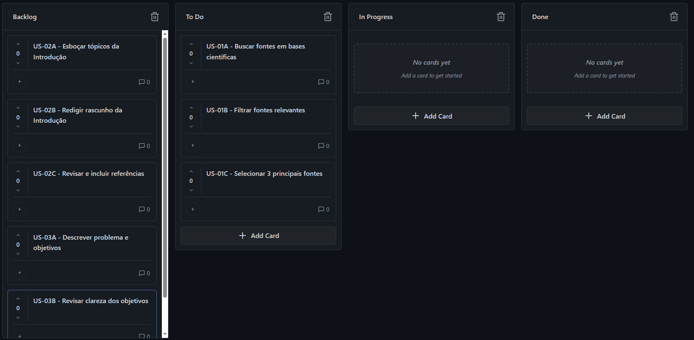
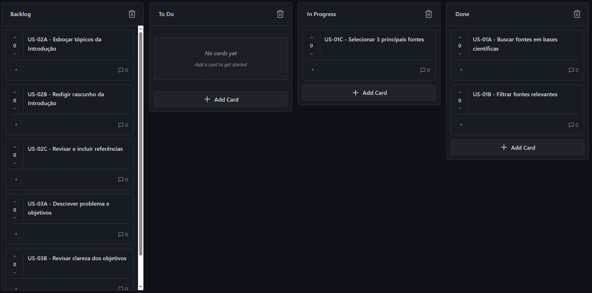
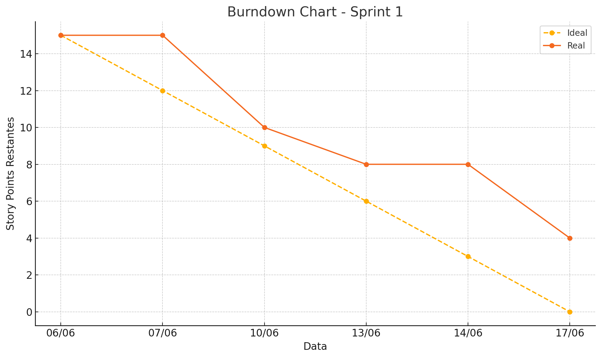

UNIVERSIDADE FEDERAL DE SANTA CATARINA

DEPARTAMENTO DE INFORMÁTICA E ESTATÍSTICA

GERÊNCIA DE PROJETOS

# **Começando o TCC**

Relatório de Execução do Projeto

Alunos: Manuela Schmitz, Gabriel Avila, Gustavo Cortez de Brito, Thayssa Yasmin Alcantara de Godoi

Florianópolis \- SC

10/06/2025

## **1\. Product Backlog**

*\[Explicar como foi definida a unidade de estimativa em pontos de história\]*  
**Unidade de estimativa**: 1 Story Point (SP) corresponde a 1 hora de trabalho.

| Prioridade | \# | Descrição | Estimativa (Pontos de História) |
| :---: | :---: | ----- | ----- |
| Alta | US-01 | Pesquisar bibliografia inicial | 15 |
| Alta | US-02 | Redigir Introdução | 8 |
| Média | US-03 | Descrever problema e objetivos | 6 |
| Média | US-04 | Elaborar justificativa e relevância | 5 |
| Baixa | US-05 | Definir metodologia de pesquisa | 7 |
| Baixa | US-06 | Planejar cronograma e riscos | 4 |

## **2\. Sprint Planning**

Velocidade do Time: 15 SP por Sprint  

### 		**2.1 Sprint 1**

***a) Objetivo(s) da Sprint***  
*\[Levantar bibliografia para o TCC.\]*  

***b) Sprint backlog e Tarefas***

| \# | Atividade/Tarefas | Estimativa  (pessoas / hora) |
| :---: | ----- | :---: |
| *US-01* | *US-01A - Buscar fontes em bases científicas* | *6* |
| *US-01* | *US-01B - Filtrar fontes relevantes* | *8* |
| *US-01* | *US-01C - Selecionar 3 principais fontes* | *1* |

### 		**2.2 Sprint 2**

***a) Objetivo(s) da Sprint***  
*\[Produzir a Introdução da proposta de TCC.\]*  

***b) Sprint backlog e Tarefas***

| \# | Atividade/Tarefas | Estimativa  (pessoas / hora) |
| :---: | ----- | :---: |
| *US-02* | *US-02A - Esboçar tópicos da Introdução* | *2* |
| *US-02* | *US-02B - Redigir rascunho da Introdução* | *5* |
| *US-02* | *US-02C - Revisar e incluir referências* | *1* |
| *US-03* | *US-03A - Descrever problema e objetivos* | *4* |
| *US-03* | *US-03B - Revisar clareza dos objetivos* | *2* |

## **3\. Quadro Kanban**

	*\[Incluir um histórico da evolução do quadro Kanban, no início e ao final de cada Sprint\]*  

### 		**3.1 Sprint 1**

  
Figura 1: Visão geral do Quadro Kanban no início da Sprint 1

  
Figura 2: Visão geral do Quadro Kanban ao final da Sprint 1

### 		**3.2 Sprint 2**

*\<FIGURA\>*  
*Figura 3: Visão geral do Quadro Kanban no início da Sprint 2*

*\<FIGURA\>*  
*Figura 4: Visão geral do Quadro Kanban ao final da Sprint 2*

## **4\. Reuniões de Acompanhamento**

	*\[Incluir prints com evidências da realização das reuniões de acompanhamento das duas sprints\]*  

### 		**4.1 Sprint 1**

**Daily 1**  
Data: 12/06/2025  
Discutimos os critérios para filtragem de artigos e as ferramentas de busca mais eficazes.  
  

**Daily 2**  
Data: 14/06/2025  
As principais fontes foram selecionadas, mas a finalização do material (US-01C) foi concluída somente no dia 17/06/2025, antes da retrospectiva da Sprint 1. 
  

### 		**4.2 Sprint 2**

***Daily 3***

*Data: \<Data\>*

*\<Resumo do que foi discutido\>*

*\<Figura com evidência da reunião\>*

*\<Figura com o gráfico de burndown atualizado\>*

***Daily 4***

*Data: \<Data\>*

*\<Resumo do que foi discutido\>*

*\<Figura com evidência da reunião\>*

*\<Figura com o gráfico de burndown atualizado\>*

## **5\. Retrospectivas**

	 *\[Relato com as retrospectivas das duas Sprints\]*

### **5.1 Sprint 1** 

* *\[Pontos de atenção*

* *O que pode ser melhorado*

* *O que manter/continuar\]*

### **5.2 Sprint 2**

* *\[Pontos de atenção*

* *O que pode ser melhorado*

* *O que manter/continuar\]*

### 		**6.1 Sprint 1**

 # | Tarefas | Resultado |
| :---: | ----- | :---: |
| US-01A | Buscar fontes |  |
| US-01B | Filtrar fontes |  |
> Nota: a tarefa US-01C foi concluída no último dia da Sprint (17/06), após o segundo daily, mas antes da retrospectiva.

### 		**6.2 Sprint 2**

| \# | Tarefas | Resultado |
| :---: | ----- | :---: |
| *US-02* | *US-02A*  | *\[Print e/ou link com evidência do resultado alcançado com a realização da tarefa\]* |
| *US-02* | *US-02B*  | *\[Print e/ou link com evidência do resultado alcançado com a realização da tarefa\]* |
| *US-02* | *US-02C*  | *\[Print e/ou link com evidência do resultado alcançado com a realização da tarefa\]* |
| *US-03* | *US-03A*  | *\[Print e/ou link com evidência do resultado alcançado com a realização da tarefa\]* |
| *US-03* | *US-03B*  | *\[Print e/ou link com evidência do resultado alcançado com a realização da tarefa\]* |

## **Sugestões de ferramentas:**

* Trello: [https://trello.com](https://trello.com)   
* Taiga: [https://taiga.io](https://taiga.io)   
* Notion: [https://www.notion.so](https://www.notion.so)   
* Monday: [https://monday.com](https://monday.com)   
* Asana: [https://asana.com](https://asana.com)   
* Click-Up: [https://clickup.com](https://clickup.com)   
* Kanbanflow: [https://kanbanflow.com](https://kanbanflow.com)
